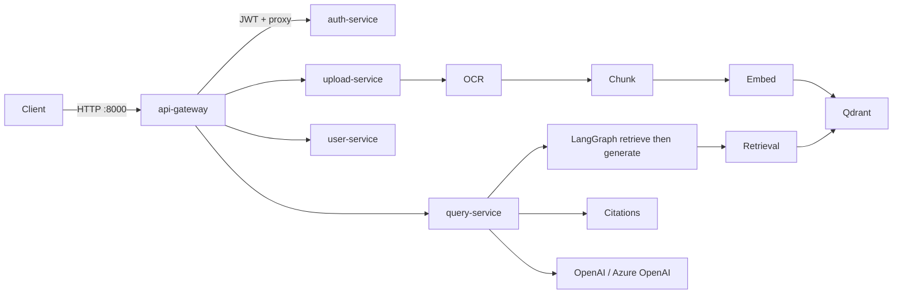

# Enterprise RAG Platform

**EU/MENA-compliant microservices RAG platform** for GenAI Engineer portfolios targeting Europe and Arab Gulf markets.

> Built for roles: GenAI Engineer · AI Engineer · MLOps Engineer

Interactive API docs (once running): http://localhost:8000/docs

## What Makes This Different

| Feature | EU Relevance | MENA/Arab Relevance |
|---------|-------------|---------------------|
| GDPR Art. 17 erasure | Right to delete user + document data | PDPL (Saudi/UAE) alignment |
| Audit logging | Banking, insurance, legal compliance | Financial sector regulations |
| Data region tagging (`EU` / `MENA`) | EU data residency requirements | Sovereign cloud deployments |
| Multi-language (EN, AR, FR, DE) | France, Germany, EU institutions | Arabic enterprise search |
| RBAC + document permissions | Healthcare, banking access control | Government & oil/gas sectors |
| Source citations | Legal defensibility | Audit trail for decisions |
| Hybrid search | Better precision for regulated docs | Arabic + English mixed corpora |
| Feedback loop | Continuous model improvement | Quality monitoring |
| Gateway `/ready` probe | Ingress / load-balancer admission | Same pattern on AKS UAE / OKE |

## Features

### North-south API gateway

- Single public entry on port **8000** — clients never call Qdrant, MinIO, or LangGraph directly
- HTTP reverse proxy (`httpx`) to 11 FastAPI microservices
- JWT required on all document, query, feedback, and user routes
- **PII redaction** on `/api/v1/query` (email, phone, card patterns) before the question is forwarded
- CORS enabled for local development
- `GET /health` — shallow liveness (process is up)
- `GET /ready` — deep readiness: probes all 11 downstream `/health` endpoints in parallel (3s timeout), returns **200** when the mesh can serve traffic and **503** when any backend is unhealthy or unreachable, including per-service `latency_ms`

### Authentication and RBAC

- JWT access tokens (**HS256**, 60-minute expiry) with `sub`, `role`, and `region` claims
- Password hashing with **bcrypt**
- Registration records a **GDPR consent** flag and an audit row
- Seeded admin: `admin@enterprise-rag.eu` / `Admin@12345`
- Four roles:

| Role | Upload | Query | Audit logs | Delete users |
|------|--------|-------|------------|--------------|
| `admin` | yes | yes | yes | yes |
| `compliance_officer` | yes | yes | yes | no |
| `analyst` | yes | yes | no | no |
| `viewer` | no | yes | no | no |

### Document ingestion pipeline

Synchronous saga orchestrated by **upload-service**:

1. **Upload** — multipart file → **MinIO** (`owner_id/doc_id/filename`) + PostgreSQL catalog row (`UPLOADED`)
2. **OCR** — text extraction from PDF, Word, Excel, PowerPoint, TXT, CSV, email
3. **Chunking** — locale-aware semantic splits (including Arabic `؟`)
4. **Embedding** — `text-embedding-3-small` (1536-d) → **Qdrant** cosine collection `enterprise_documents`
5. Catalog status advances `UPLOADED → OCR_DONE → CHUNKING → INDEXED`

Accepted types: PDF, DOC/DOCX, XLS/XLSX, PPT/PPTX, TXT, CSV, RFC822 email. Metadata stores department, locale, tags, `data_region`, and `allowed_roles`.

### RAG query (LangChain / LangGraph)

- **query-service** runs a compiled LangGraph `StateGraph`: `retrieve → generate → END`
- Shared `RAGState`: `question`, `locale`, `retrieval_results`, `context`, `answer`
- Locale-specific system prompts for **EN / AR / FR / DE** — answers only from retrieved context, temperature `0.1`
- OpenAI-compatible chat API (`gpt-4o-mini` by default); set `OPENAI_BASE_URL` for **Azure OpenAI**
- Dev fallback when no LLM key is present — retrieval and citations still work
- **citation-service** builds source attribution (`filename`, page, chunk, excerpt, score)

### Hybrid retrieval

- Query embedding in the same 1536-d space as indexed chunks
- Qdrant ANN search with optional **locale** and **department** payload filters
- Combined score: **70% semantic (cosine) + 30% keyword (token overlap)**
- Over-fetches `2 × top_k`, re-ranks, then returns `top_k` (default 5, max 20)

### Compliance and data protection

- **GDPR Art. 17** — `DELETE /api/v1/users/me` cascades user, documents, and feedback; embedding-service can delete vectors by `document_id`
- **GDPR Art. 30** — audit log of login, upload, delete, query, feedback, consent, access denied
- Every record tagged `EU` or `MENA`
- PII redaction at the gateway before the question hits LangGraph
- Audit log retention setting (default 365 days)

### Quality loop

- `POST /api/v1/feedback` — rating 1–5, optional comment, helpful flag
- Feedback-service stores rows and audit events; `/feedback/stats` reports helpful rate

### Data plane

| Store | Role |
|-------|------|
| **PostgreSQL 16** | Users, document catalog, feedback, audit logs |
| **Qdrant** | Vector index (cosine, 1536-d) |
| **MinIO** | S3-compatible raw document blobs |
| **Redis 7** | Reserved for session / rate limiting |

### Platform and delivery

- **Docker Compose** — 12 app services + Postgres, Redis, Qdrant, MinIO on one bridge network (service-name DNS)
- **Kubernetes** — `enterprise-rag` namespace (`data-region: eu`), API gateway Deployment (2 replicas) + `Service` `type: LoadBalancer` (`80 → 8000`)
- **Terraform** — versioned, AES256-encrypted S3 bucket tagged `DataRegion=EU`
- **GitHub Actions CI** — Python 3.11 syntax check + Docker image builds for gateway and query-service
- Shared library `enterprise_rag_common` — settings, JWT, models, GDPR helpers, SQLAlchemy models

## Architecture

```
Users → API Gateway → Auth → Microservices → Qdrant / PostgreSQL / MinIO / Redis
                              ├── Upload → OCR → Chunking → Embedding
                              └── Query (LangGraph) → Retrieval → Citation → LLM
```



### Microservices (12)

| Service | Host port | Responsibility |
|---------|-----------|----------------|
| api-gateway | 8000 | Single entry, routing, JWT, PII redaction, `/ready` |
| auth-service | 8001 | JWT, RBAC, GDPR consent |
| user-service | 8002 | Profiles, Art. 17 erasure, audit logs |
| upload-service | 8003 | MinIO storage, ingestion orchestration |
| ocr-service | 8004 | PDF/Word/Excel/PPT text extraction |
| chunking-service | 8005 | Locale-aware semantic chunking |
| embedding-service | 8006 | OpenAI embeddings → Qdrant |
| metadata-service | 8007 | Document catalog, RBAC |
| retrieval-service | 8008 | Hybrid semantic + keyword search |
| query-service | 8009 | LangGraph RAG orchestration |
| citation-service | 8010 | Source attribution |
| feedback-service | 8011 | Quality feedback loop |

Internal containers listen on **8000**. Compose publishes `8001`–`8011` on the host for debugging. East-west calls use Docker DNS, e.g. `http://query-service:8000`.

### Networking and ingress

| Layer | Current implementation |
|-------|------------------------|
| North-south | Only the API gateway is the intended public entry |
| Dev edge | Docker publish `8000:8000` |
| Prod edge | Kubernetes `Service` `type: LoadBalancer`, port `80` → pod `8000` |
| Readiness | `GET /ready` for load-balancer / future Ingress admission |
| L7 Ingress | Not checked in yet (Helm + ArgoCD is Phase 6) — no TLS or host/path rules in-repo |
| Data plane | Postgres, Qdrant, MinIO, Redis stay on the private network |

## Gateway API

| Method | Path | Auth | Purpose |
|--------|------|------|---------|
| GET | `/health` | no | Liveness |
| GET | `/ready` | no | Deep readiness of all backends |
| POST | `/api/v1/auth/register` | no | Create user + GDPR consent |
| POST | `/api/v1/auth/login` | no | Issue JWT |
| GET | `/api/v1/users/me` | yes | Current profile |
| DELETE | `/api/v1/users/me` | yes | GDPR Art. 17 erasure |
| POST | `/api/v1/documents/upload` | yes | Store file in MinIO |
| GET | `/api/v1/documents` | yes | List documents for the caller |
| POST | `/api/v1/documents/{id}/index` | yes | OCR → chunk → embed |
| POST | `/api/v1/query` | yes | LangGraph RAG + citations |
| POST | `/api/v1/feedback` | yes | Rate an answer |
| GET | `/api/v1/audit-logs` | admin / compliance | Audit trail |

## Quick Start

### Prerequisites

- Docker Desktop
- OpenAI API key (optional — dev fallback works without it)

### 1. Configure environment

```bash
cp .env.example .env
# Edit OPENAI_API_KEY in .env for production-quality answers
```

### 2. Start all services

```bash
docker compose up -d --build
```

### 3. Verify health

```bash
curl http://localhost:8000/health
curl http://localhost:8000/ready
```

`/health` is a shallow liveness check (process up). `/ready` probes all 11 downstream services and returns **503** if any are unreachable — use this for load-balancer / Ingress readiness.

### 4. Login (seeded admin)

```bash
curl -X POST http://localhost:8000/api/v1/auth/login \
  -H "Content-Type: application/json" \
  -d '{"email":"admin@enterprise-rag.eu","password":"Admin@12345"}'
```

### 5. Upload and index a document

```bash
TOKEN="<access_token_from_login>"

curl -X POST http://localhost:8000/api/v1/documents/upload \
  -H "Authorization: Bearer $TOKEN" \
  -F "file=@./docs/sample-policy.pdf" \
  -F "department=Compliance" \
  -F "locale=en"

curl -X POST http://localhost:8000/api/v1/documents/<document_id>/index \
  -H "Authorization: Bearer $TOKEN"
```

Sample locale files: `docs/sample-policy.txt` (EN), `docs/policy-ar.txt`, `docs/policy-fr.txt`, `docs/policy-de.txt`.

### 6. Query

```bash
curl -X POST http://localhost:8000/api/v1/query \
  -H "Authorization: Bearer $TOKEN" \
  -H "Content-Type: application/json" \
  -d '{"question":"What is our data retention policy?","locale":"en","hybrid":true}'
```

### 7. Feedback and account erasure

```bash
curl -X POST http://localhost:8000/api/v1/feedback \
  -H "Authorization: Bearer $TOKEN" \
  -H "Content-Type: application/json" \
  -d '{"query_id":"<query_id>","rating":5,"helpful":true}'

curl -X DELETE http://localhost:8000/api/v1/users/me \
  -H "Authorization: Bearer $TOKEN"
```

Makefile shortcuts: `make up`, `make health`, `make seed`, `make logs`, `make down`.

## Production Deployment (EU / MENA)

| Component | EU Recommendation | MENA Recommendation |
|-----------|-------------------|---------------------|
| LLM | Azure OpenAI (Sweden/West Europe) | Azure OpenAI UAE / local LLM |
| Vector DB | Qdrant on AKS/EKS eu-west-1 | Qdrant on Azure UAE |
| Object Storage | AWS S3 eu-west-1 / Azure Blob EU | AWS me-south-1 / OCI KSA |
| Secrets | Azure Key Vault / AWS Secrets Manager | Same, region-locked |
| K8s | EKS eu-west-1, AKS West Europe | AKS UAE North, OKE |
| CI/CD | GitHub Actions → ArgoCD | Same pattern |
| Monitoring | Prometheus + Grafana + Loki | Same, PDPL-compliant logging |

## Project Roadmap

- [x] Phase 1: Microservices scaffold + Docker Compose
- [x] Phase 2: Ingestion pipeline (Upload → OCR → Chunk → Embed)
- [x] Phase 3: RAG query with LangGraph + citations
- [x] Phase 4: GDPR/RBAC/multi-language foundations
- [x] Phase 4.1: Gateway `/ready` probe for load-balancer / Ingress admission
- [ ] Phase 5: SharePoint/Confluence connectors
- [ ] Phase 6: Helm charts + ArgoCD GitOps
- [ ] Phase 7: Prometheus metrics + Grafana dashboards
- [ ] Phase 8: React admin UI with Arabic RTL

## License

Apache-2.0
